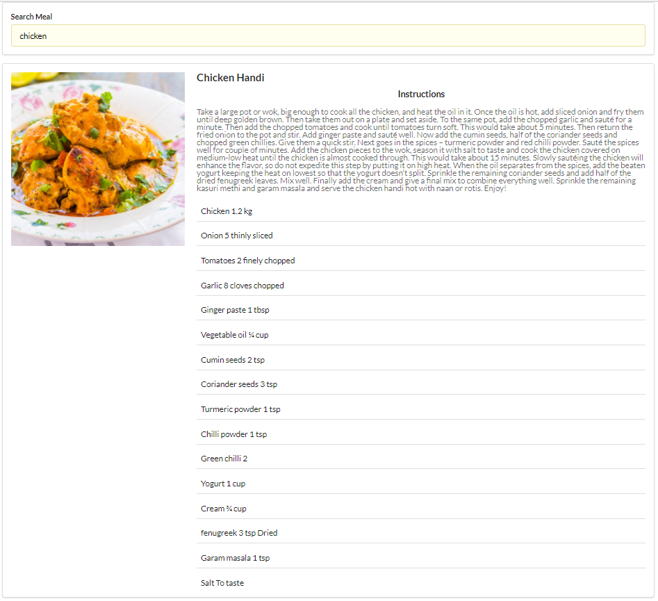

# Getting Started with Meal finder React App

## Available Scripts

In the project directory, you can run:

### `npm start`

Runs the app in the development mode.\
Open [http://localhost:3000](http://localhost:3000) to view it in the browser.

The page will reload if you make edits.\
You will also see any lint errors in the console.

### `Find your favorite meal by typing the name`

After you type your favorite meal and press Enter there will appear lots of diffrent types of food from diffrent origin .
By default the first meal will apear with cooking instructions.If you want see other meal cooking instructions you can just click and it will show you the the ingredients and instructions of particular recipe :)# meal-finder-with-react

[Heroku ](https://meal-finder-with-react.herokuapp.com/)

